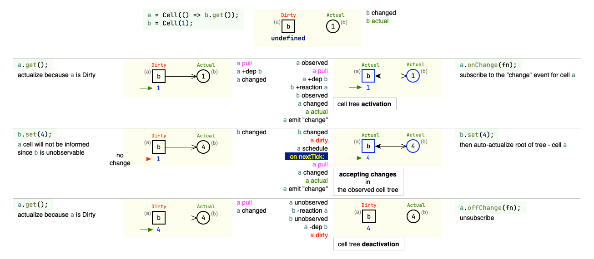

# Installation

Install by npm:

```shell
npm install --save @do-while-for-each/tree-cell
```

or install with yarn:

```shell
yarn add @do-while-for-each/tree-cell
```

# What is it anyway?

**tree-cell** is another implementation of pull-based reactivity. If you don't know what it is yet, then perhaps you know about such projects as: Vue.js or MobX – yes, they use this type of reactivity. Quite well they gave an introductory here: [What is Reactivity?](https://vuejs.org/guide/extras/reactivity-in-depth.html#what-is-reactivity)

Consider an example from [MobX - Observable state](https://mobx.js.org/observable-state.html#makeobservable):

```typescript
import {actualizeScheduledCells, autorun, cell, makeObservable} from '@do-while-for-each/tree-cell';

class Doubler {
  constructor(private value) {
    makeObservable(this, {
      value: cell,  // observable
      double: cell, // observable
    });
  }

  get double() {
    return this.value * 2;
  }

  increment() {
    this.value++;
  }
}

const obj = new Doubler(1);

const dispose = autorun(() => { // create observable cell tree
  console.log(obj.double);
});

obj.increment();
actualizeScheduledCells();
obj.increment();
actualizeScheduledCells();
obj.increment();

dispose();
```

output:

```shell
2
4
6
8
```

if comment out `actualizeScheduledCells();` then the output will be like this:

```shell
2 // autorun => creating the observable cell tree
8 // result of auto-actualization of the observable cell tree
```

this is because when multiple state changes happen:

```typescript
obj.increment();
//actualizeScheduledCells();
obj.increment();
//actualizeScheduledCells();
obj.increment();
```

by default, only the latest state is taken into account at the moment changes are applied.

---

> ⚠ New changes will be applied only after changes stop happening in the system (after clearing the call stack).

Thus, if you don't need this kind of debouncing, then call function `actualizeScheduledCells();` in appropriate places.

---

If you need to actualize the entire cell tree after each state change, then it is better to make a change to the method itself:

```typescript
class Doubler {
  //...

  increment() {
    this.value++;
    actualizeScheduledCells();
  }
}

//...

obj.increment();
obj.increment();
obj.increment();
```

output:

```shell
2
4
6
8
```

Let's look at another example:

```typescript
import {autorun, cell, makeObservable} from '@do-while-for-each/tree-cell';

class TomAndJerry {
  name = 'Tom';
  kind = 'Cat';

  constructor() {
    makeObservable(this, {
      name: cell, // observable
      kind: cell, // observable
      full: cell, // computed
    });
  }

  get full() {
    return this.name + ' ' + this.kind;
  }
}

const obj = new TomAndJerry();

const dispose = autorun(() => { // create observable cell tree
  console.log(obj.full);
});

obj.name = 'Jerry';
obj.kind = 'Mouse';

dispose();
```

output:

```shell
Tom Cat
Jerry Mouse
```

As you can see, despite the fact that the state of two cells changed sequentially, the result was computed only once.

# Annotating properties

As you probably already noticed, it is required to annotate the object properties.

The following annotations are available:

- `asyncCell` – binds a property to a cell of type `AsyncCell` – the cell whose value changes asynchronously. The passed function is expected to return a value of one of the following types: `Promise`, `AsyncIterable` or `Iterable`. Or you can set value of these types directly to the property.
- `obsValueCell` – binds a property to a cell of type `ObsValueCell` – the cell whose value can be observable. The cell listens for Changes of value and propagates them. Observable values are created using functions: `createObsArray`, `createObsMap`.
- `cell` – binds a property to a cell of type `Cell` – if the previous annotation options didn't suit you, then just use this one.

# What properties can be annotated

The following property type designations are used here:


Accordingly, the following properties can be annotated:

| annotation     | method | value | getter | accessor | setter |
|----------------|--------|-------|--------|----------|--------|
| `asyncCell`    | ✅     | ✅    | ❌     | ❌      | ❌     |
| `obsValueCell` | ❌     | ✅    | ❌     | ❌      | ❌     |
| `cell`         | ✅     | ✅    | ✅     | ❌      | ❌     |

Also, for **value** properties, a change is performed:

- for annotation `asyncCell` the **value** is transformed into a **getter**;
- for annotation `obsValueCell` and `cell` the **value** is transformed into an **accessor**.

As a result, the annotated property becomes one of:

| annotation     | method | value | getter | accessor | setter |
|----------------|--------|-------|--------|----------|--------|
| `asyncCell`    | ◉      |       | ◉      |          |        |
| `obsValueCell` |        |       |        | ◉        |        |
| `cell`         | ◉      |       | ◉      | ◉        |        |

# Advanced usage

Under the hood, everything just works on cells.

**tree-cell** doesn't limit you, you can use the `makeObservable`-`annotation`-`autorun` bundle, or you can write code directly using cells, or you can mix both of these approaches.

Let's rewrite the above example `TomAndJerry` using only cells (you'll see part of the magic that happens when you use the `makeObservable`-`annotation`-`autorun` bundle):

```typescript
import {Cell} from '@do-while-for-each/tree-cell';

class TomAndJerry {
  name = new Cell('Tom');
  kind = new Cell('Cat');

  constructor() {
    const fullDescr = Object.getOwnPropertyDescriptor(Object.getPrototypeOf(this), 'full')!;
    const fullCell = new Cell(fullDescr.get!.bind(this));
    Object.defineProperty(this, 'full', { // makeObservable
      get() {
        return fullCell.get();
      }
    });
  }

  get full(): string {
    return this.name.get() + ' ' + this.kind.get();
  }
}

const obj = new TomAndJerry();

const rootCell = new Cell(() => { // autorun
  console.log(obj.full);
});
const onChangeHandler = () => {
};
rootCell.onChange(onChangeHandler); // create observable cell tree

obj.name.set('Jerry');
obj.kind.set('Mouse');

rootCell.offChange(onChangeHandler); // dispose
```

output:

```shell
Tom Cat
Jerry Mouse
```

Here `name` and `kind` are data cells. And `fullCell` is a function-based cell or a computed cell.

# tree-cell vs RxJS

## Advantages of tree-cell

1. Acceptance of changes in **the observable cell tree** always happens in a [nextTick](https://nodejs.org/en/docs/guides/event-loop-timers-and-nexttick/#process-nexttick)(in the Node.js environment) or in a [microtask](https://developer.mozilla.org/en-US/docs/Web/API/queueMicrotask)(in the browser environment).
2. As a consequence of (1), by default **tree-cell** automatically debounce changes. Debouncing speeds up the program, because interim changes are not applied.
3. In most cases, it is not necessary to control subscriptions/unsubscribing. Everything happens automatically based on just your code.
4. Also, all sorts of merging/switching streams become unnecessary, for example, such: `merge`, `switchMap`, `combineLatest`, etc.
5. Built-in `distinctUntilChanged`. Each new value is compared for equality with the previous one, using `Object.is`. You can also pass your comparison implementation - `option.isEqual`, as well as map the object fields before comparison - `option.equalsMapping`.
6. To get a value, you don't need to do something like this: Observable to Promise -> await Promise -> value.
7. There is a feeling that it is more optimal and consumes less memory.
8. The program has less unnecessary code and the code is more natural.

## Disadvantages of tree-cell

### 1. Filtering the resulting cell value

RxJS has a wonderful `filter` operator. In the ideology of cells, it is impossible to apply the same filter to the resulting value.  
Consider an example:

```typescript
const a = new Cell(1);
const b = new Cell(() => a.get(), {filter: value => value > 0});
a.set(-1);
console.log(b.get()); // what will be displayed in the console?
```

The value of cell `a` has changed, while `b` depends on `a` and must also change, otherwise `b` becomes invalid.  
Accordingly, one cannot simply ignore the change in `a` just because the filter `b` does not pass the result.  
The only way out is **to throw an error**.

_"How then to be? I need regular filters that don't throw an error"_

1. Don't use a filter on cells.
2. The filtering logic must be implemented in the subscription to the cell you are interested in:

```typescript
const a = new Cell(1);
const b = new Cell(() => a.get());

b.on('change', ({value}) => {
  if (value > 0)
    console.log(`b`, value);
});
```

# Some test schemes

## Terminology


## Test: `a[fn] -> b[data]`



## Test: `a -> b ? m : c`


# TODO

- observable things:
  - ObsSet,
  - ObsList,

# Inspired by

1. [franzzua / @cmmn/cell](https://github.com/franzzua/cmmn/tree/master/cell)
2. [Riim / cellx](https://github.com/Riim/cellx/)

